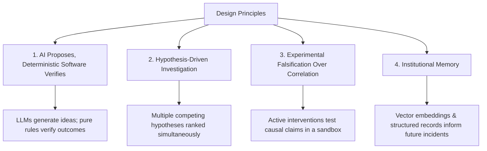
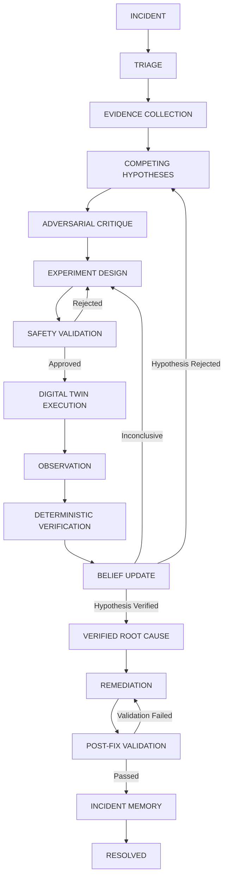
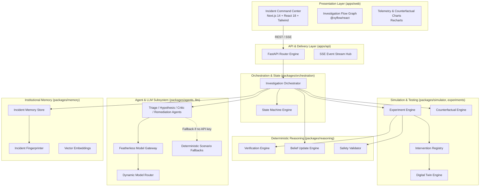
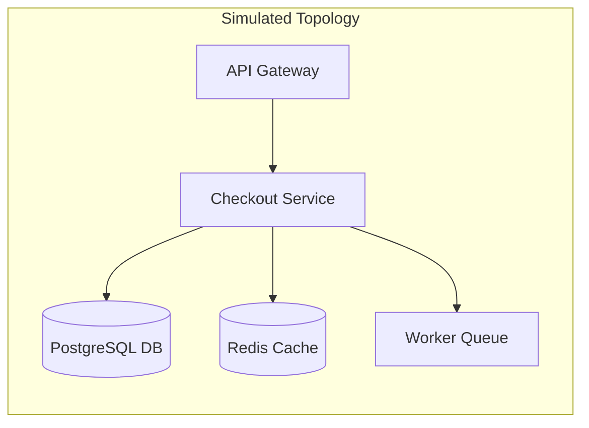
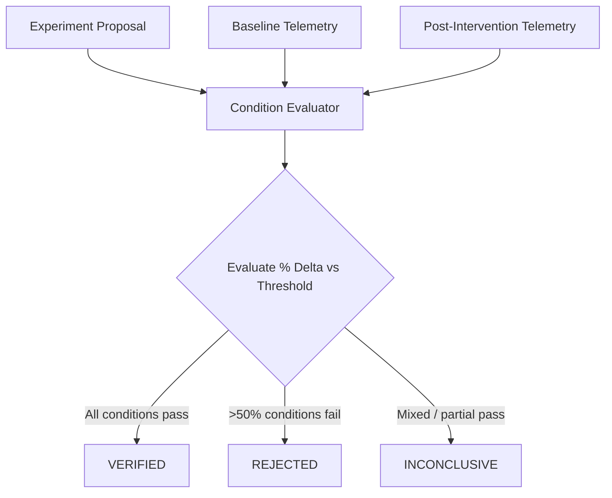
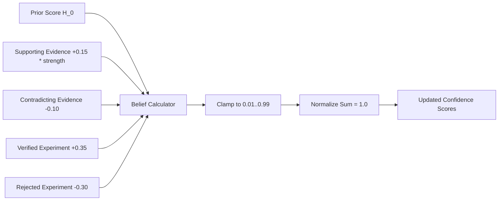
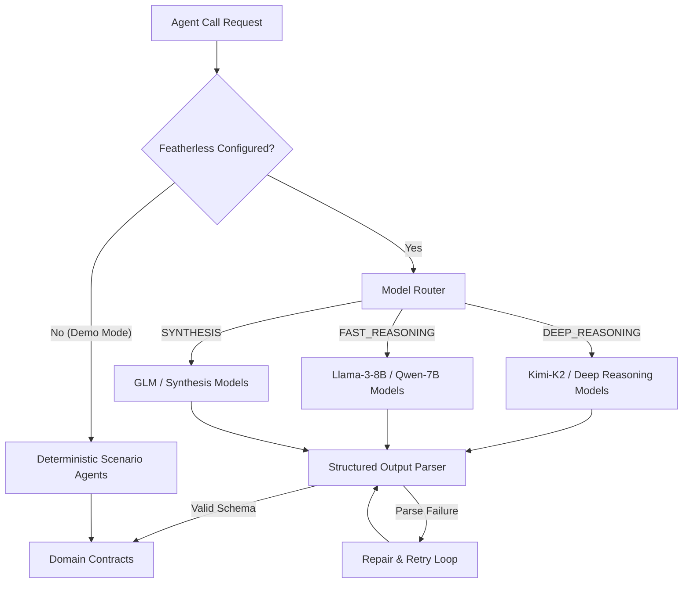
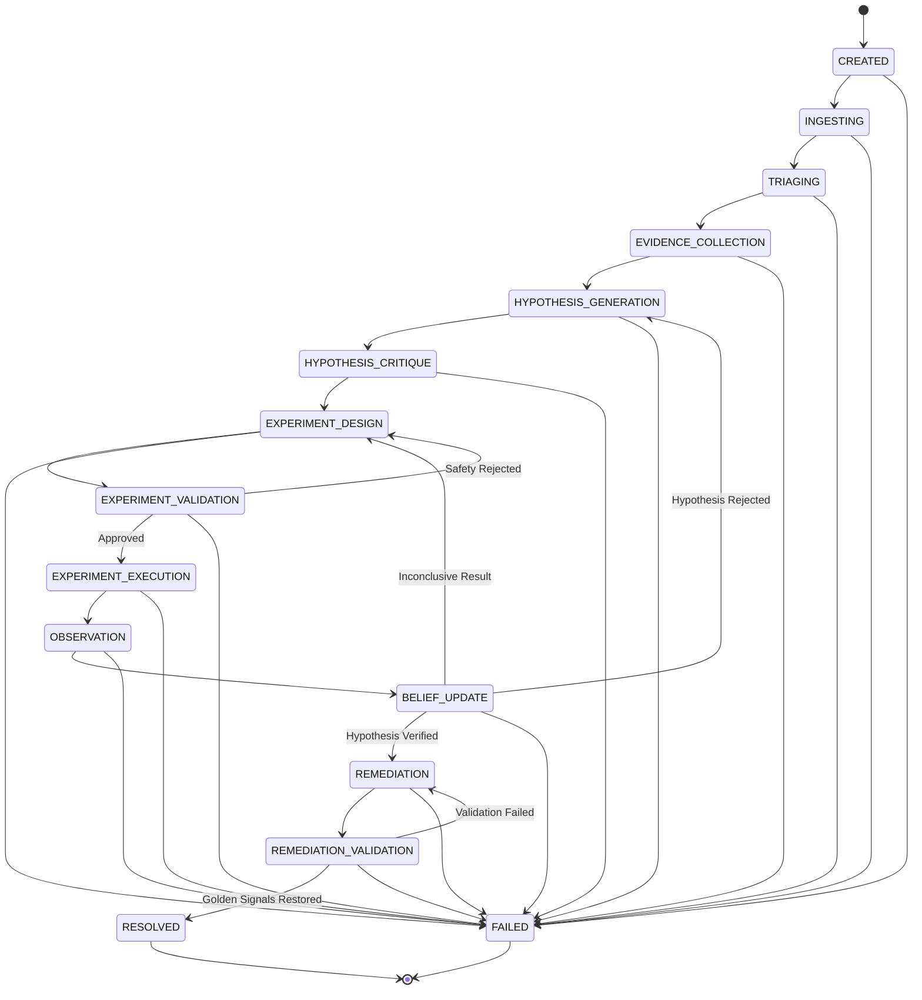
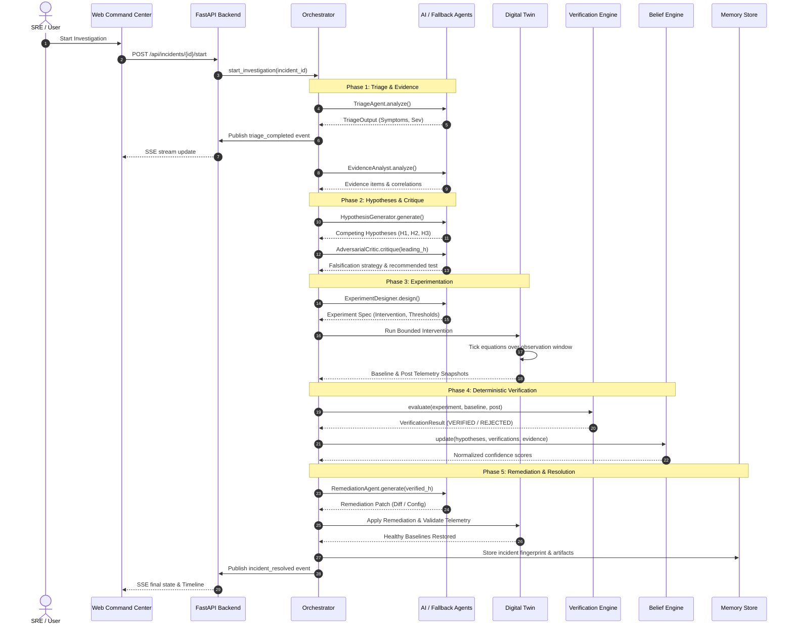
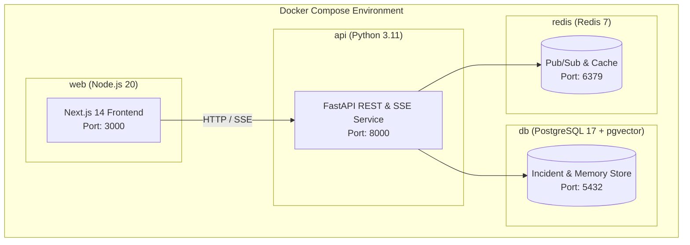

# IncidentForge Architecture

IncidentForge is an AI-powered incident response and root-cause analysis system that transforms site reliability engineering (SRE) by treating incident response as an **experimental reasoning problem**. 

Rather than relying on hallucination-prone correlation or unverified LLM narrative summaries, IncidentForge operates under a foundational tenet:

> **"AI proposes. Evidence challenges. Experiments test. Deterministic software verifies."**

```
+-----------------------------------------------------------------------------------+
|                                INCIDENTFORGE CORE                                |
|                                                                                   |
|   +-------------------+      +-------------------+      +---------------------+   |
|   |    AI Agents      | ---> |   Digital Twin    | ---> | Deterministic Rules |   |
|   | Propose Hypotheses|      | Execute Controlled|      | Verify Predictions  |   |
|   | & Design Tests    |      | Interventions     |      | & Update Beliefs    |   |
|   +-------------------+      +-------------------+      +---------------------+   |
+-----------------------------------------------------------------------------------+
```

---

## Table of Contents

1. [Design Principles](#design-principles)
2. [Investigation Lifecycle](#investigation-lifecycle)
3. [System Architecture](#system-architecture)
4. [Digital Twin Simulation Engine](#digital-twin-simulation-engine)
5. [Deterministic Verification Engine](#deterministic-verification-engine)
6. [Belief Update System](#belief-update-system)
7. [Agent Pipeline & Model Routing](#agent-pipeline--model-routing)
8. [Investigation State Machine](#investigation-state-machine)
9. [End-to-End Data Flow](#end-to-end-data-flow)
10. [Infrastructure & Deployment](#infrastructure--deployment)
11. [API Layer & Interfaces](#api-layer--interfaces)

---

## Design Principles

IncidentForge is engineered around four core architectural principles:



### 1. AI Proposes, Deterministic Software Verifies
Large Language Models (LLMs) excel at creative synthesis, broad semantic search, and generating diverse hypotheses across complex multi-service topologies. However, LLMs are non-deterministic and prone to hallucination. IncidentForge delegates all decision gates, safety checks, metric comparisons, and belief scoring to pure, rule-based deterministic software.

### 2. Hypothesis-Driven Investigation
Incidents are not diagnosed by single-shot prompt queries. Instead, the system formulates multiple competing hypotheses to account for ambiguous telemetry (e.g., distinguishing between a connection leak, a cache stampede, and an unindexed query regression). Hypotheses are maintained in parallel with explicit confidence scores.

### 3. Experimental Falsification Over Correlation
Correlation does not imply causation. A spike in CPU utilization during an outage may be a symptom rather than the cause. IncidentForge uses an adversarial approach: it designs controlled experiments to actively attempt to falsify competing hypotheses against a deterministic Digital Twin before endorsing a remediation plan.

### 4. Institutional Memory
Every verified root cause, validated experiment, and successful remediation patch is fingerprinted, embedded with semantic vectors, and persisted to long-term memory. Future investigations retrieve relevant historical precedents during early triage to accelerate root-cause isolation.

---

## Investigation Lifecycle

The IncidentForge investigation lifecycle follows a strict, state-enforced pipeline from initial anomaly detection through post-fix institutional storage.



### Lifecycle Stage Breakdown

| Phase | Responsible Component | Key Operations & Artifacts |
| :--- | :--- | :--- |
| **INCIDENT** | Ingestion / Trigger | Anomaly ingested with raw telemetry snapshots, alert metadata, and system identifiers. |
| **TRIAGE** | `TriageAgent` | Classifies incident type, computes severity (`SEV_1` to `SEV_4`), identifies affected services and initial symptoms. **Does not guess root cause.** |
| **EVIDENCE COLLECTION** | `EvidenceAnalyst` | Extracts logs, metrics, trace patterns, configuration diffs, and deployment records. Assigns evidence strength ($0.0 \dots 1.0$). |
| **COMPETING HYPOTHESES** | `HypothesisGenerator` | Produces $N$ competing causal explanations with specific testable predictions (metric changes and thresholds). |
| **ADVERSARIAL CRITIQUE** | `AdversarialCritic` | Challenges leading hypotheses, identifies unstated assumptions, checks for conflicting evidence, and formulates falsification criteria. |
| **EXPERIMENT DESIGN** | `ExperimentDesigner` | Formulates an executable experiment: selects an intervention, parameters, target component, baseline, and expected metric thresholds. |
| **SAFETY VALIDATION** | `SafetyValidator` | Validates proposed intervention against registered schemas, allowed targets, parameter bounds, and observation window constraints. |
| **DIGITAL TWIN EXECUTION** | `DigitalTwin` / `ExperimentEngine` | Clones system state, executes the bounded intervention in simulation, and ticks the causal equations over the observation window. |
| **OBSERVATION** | `ExperimentEngine` | Captures baseline and post-intervention `TelemetrySnapshot` metrics (latencies, errors, pool utilization, CPU, cache hit rate). |
| **DETERMINISTIC VERIFICATION** | `VerificationEngine` | Compares observed metric deltas against predicted thresholds using pure rule evaluation. Outputs `VERIFIED`, `REJECTED`, or `INCONCLUSIVE`. |
| **BELIEF UPDATE** | `BeliefUpdateEngine` | Updates hypothesis confidence scores using Bayesian-inspired weighting. Normalizes scores across all active candidates. |
| **VERIFIED ROOT CAUSE** | Orchestrator | Promotes the hypothesis surpassing confidence thresholds with passing verification to the authoritative root cause. |
| **REMEDIATION** | `RemediationAgent` | Generates a targeted fix: code patch diff, configuration alteration, feature flag change, or rollback instruction. |
| **POST-FIX VALIDATION** | `DigitalTwin` / Orchestrator | Applies remediation patch to the twin, ticks forward, and verifies return of all golden signals to healthy baselines. |
| **INCIDENT MEMORY** | `IncidentMemoryStore` | Generates fingerprint embedding, pairs symptoms and verified interventions, and persists the incident record for future retrieval. |

---

## System Architecture

IncidentForge is structured as a modular monorepo cleanly separating UI, API routing, orchestration, agent definitions, simulation models, and deterministic reasoning engines.

```
c:\Users\danis\Desktop\IncidentForge\
├── apps/
│   ├── api/                  # FastAPI backend service
│   │   ├── routes/           # REST & SSE route controllers
│   │   ├── main.py           # Application entrypoint & CORS middleware
│   │   ├── services.py       # Shared singleton service registry
│   │   └── config.py         # Environment configuration
│   └── web/                  # Next.js 14 frontend (Incident Command Center)
│       ├── src/app/          # App router pages & layouts
│       ├── src/components/   # React components (Flow, Charts, Metric cards)
│       └── src/lib/          # API client & SSE consumer utilities
├── packages/
│   ├── contracts/            # Pydantic domain models, agent I/O, event schemas
│   ├── simulator/            # Deterministic checkout-service Digital Twin
│   ├── reasoning/            # Rule verification, belief updates, safety validation
│   ├── experiments/          # Experiment execution engine & counterfactual replay
│   ├── agents/               # AI agents & deterministic fallback implementations
│   ├── llm/                  # Featherless AI gateway, model routing, JSON parser
│   ├── orchestration/        # Investigation orchestrator & state machine
│   └── memory/               # Vector embeddings, fingerprinting, incident store
├── database/                 # PostgreSQL & pgvector initialization scripts
├── infra/                    # Deployment manifests & infrastructure configs
└── scenarios/                # Pre-configured incident scenarios (e.g. incident-001)
```

### Monorepo Packages Breakdown



---

## Digital Twin Simulation Engine

The Digital Twin (`packages/simulator/twin.py`) is a deterministic, tick-based mathematical simulation of a high-throughput microservices checkout service stack.



### Telemetry Signals Modeled

The simulation maintains continuous, causally bound telemetry metrics:
- **`request_rate`**: Inbound HTTP requests per second (baseline: 1,500 req/s).
- **`p50_latency`**, **`p95_latency`**, **`p99_latency`**: Millisecond response latencies derived from query cost, pool wait times, and CPU saturation.
- **`error_rate`**: Ratio of failed requests ($0.0 \dots 1.0$) driven by tail-latency timeouts and queue drops.
- **`db_connections`**: Active client connections vs. total pool size (default pool: 100).
- **`db_utilization`**: Relational database compute/IO utilization ($0.0 \dots 1.0$).
- **`cache_hit_rate`**: Redis cache hit ratio ($0.0 \dots 1.0$).
- **`cpu`**: CPU load factor on checkout service nodes ($0.0 \dots 1.0$).
- **`memory`**: Memory utilization fraction.
- **`queue_depth`**: Backlogged tasks in the worker queue.

### Causal Equations & Mathematical Dynamics

The Digital Twin calculates internal mechanics each tick ($t$):

1. **Connection Pressure & Exponential Wait Time**:
   $$\text{db\_pressure} = \frac{\text{active\_connections}}{\text{db\_pool\_size}}$$
   $$\text{wait\_time} = \begin{cases} 150.0 \times \exp\left((\text{db\_pressure} - 0.8) \times 8.0\right), & \text{if } \text{db\_pressure} > 0.8 \\ 0.0, & \text{otherwise} \end{cases}$$

2. **Cache Misses & Database Queries**:
   $$\text{cache\_misses} = \text{request\_rate} \times (1.0 - \text{cache\_hit\_rate})$$
   $$\text{effective\_db\_queries} = (0.3 \times \text{request\_rate}) + (0.8 \times \text{cache\_misses})$$

3. **Database Utilization & Saturation**:
   $$\text{db\_utilization} = \min\left(1.0, \frac{\text{effective\_db\_queries} \times \text{db\_query\_cost\_ms}}{25000.0} + 0.3 \times \text{db\_pressure}\right)$$
   $$\text{db\_saturation\_wait} = \max\left(0.0, (\text{db\_utilization} - 0.75) \times 1600.0\right)$$

4. **CPU Load & Tail Latency**:
   $$\text{cpu} = \min\left(1.0, 0.15 + \frac{\text{effective\_db\_queries}}{12000.0} + \frac{\text{active\_connections}}{500.0} + \text{cpu\_overhead}\right)$$
   $$\text{cpu\_latency} = \begin{cases} (\text{cpu} - 0.7) \times 500.0, & \text{if } \text{cpu} > 0.7 \\ 0.0, & \text{otherwise} \end{cases}$$
   $$\text{p95\_latency} = \text{base\_latency} + \text{query\_latency} + \text{wait\_time} + \text{db\_saturation\_wait} + \text{cpu\_latency}$$

5. **Error Rate Progression**:
   Timeout probabilities accumulate when tail latency crosses thresholds (250ms: +3%, 500ms: +8%, 800ms: +12%, CPU > 95%: +10%).

### Fault Injections

The simulator natively reproduces three distinct, high-impact production failure modes:

| Fault Type | Initial Symptoms | Root Cause Mechanism |
| :--- | :--- | :--- |
| `connection_leak` | p95 latency spikes, connection pool saturates, moderate cache degradation | Leaked database connections fail to return to the pool upon request completion; exponential wait queue triggers HTTP timeouts. |
| `cache_stampede` | Cache hit rate collapses (<20%), DB utilization spikes to 95%+, CPU elevates | Key invalidation or TTL expiry causes massive parallel database queries for hot checkout items. |
| `query_regression` | DB utilization rises, CPU rises, queue depth expands, connection pool stable | Unindexed database join introduced in a new deployment ($v1.8$) escalates average `db_query_cost_ms` from 15ms to 60ms. |

### Registered Safe Interventions

Interventions are strictly sandboxed via `InterventionRegistry` (`packages/simulator/interventions.py`):
- `connection_pool_reset`: Flushes and resets active DB connections to 10% capacity. Clears active connection leak parameters.
- `cache_flush`: Clears cache contents (hit rate drops to 5%) to observe recovery behavior.
- `cache_ttl_change`: Adjusts Redis TTL parameters (`ttl_seconds` $\in [1, 86400]$) to recover stampeded keys.
- `deployment_rollback`: Reverts application binary to specified target version (e.g. `v1.7`).
- `feature_flag_disable`: Toggles registered feature flags (e.g. `new_checkout_flow`).
- `worker_restart`: Clears queue depth and restarts async worker processes.

---

## Deterministic Verification Engine

The Verification Engine (`packages/reasoning/verification.py`) contains **zero LLM logic**. It provides mathematically rigid verification of experiment outcomes.



### Evaluation Protocol

For each predicted `MetricExpectation` in an experiment:
1. Baseline value ($B$) and Post-intervention value ($P$) are extracted from `TelemetrySnapshot`.
2. The percentage change is computed:
   $$\Delta\% = \frac{P - B}{|B|} \times 100.0$$
3. Evaluated against direction and threshold ($T\%$):
   - **`DECREASE`**: Condition passes if $\Delta\% \le -T$
   - **`INCREASE`**: Condition passes if $\Delta\% \ge T$
   - **`STABLE`**: Condition passes if $|\Delta\%| < 5.0\%$

### Decision Rules

- **`VERIFIED`**: $100\%$ of predicted conditions pass ($P_{\text{passed}} == N_{\text{total}}$). Proves the causal hypothesis.
- **`REJECTED`**: A majority of predicted conditions fail ($P_{\text{failed}} > N_{\text{total}} / 2$). Falsifies the hypothesis.
- **`INCONCLUSIVE`**: Partial pass rate without majority failure ($0 < P_{\text{passed}} < N_{\text{total}}$). Triggers experiment redesign.

Every condition produces a granular audit record:
```json
{
  "metric": "p95_latency",
  "expected": "decrease >= 50.0%",
  "baseline_value": 482.4,
  "observed_value": 68.2,
  "passed": true,
  "detail": "p95_latency: baseline=482.40, post=68.20, change=-85.9%, expected decrease >= 50.0% -> PASS"
}
```

---

## Belief Update System

The Belief Update Engine (`packages/reasoning/belief.py`) applies a transparent, Bayesian-inspired formula to score and rank competing hypotheses. No LLM generates confidence numbers.



### Scoring Weights

$$\text{RawScore}(H) = S_{\text{prior}} + \sum_{e \in \text{Support}} (0.15 \times \text{strength}_e) - \sum_{c \in \text{Contradict}} 0.10 + \Delta_{\text{experiment}}$$

Where $\Delta_{\text{experiment}}$ is:
- $+0.35$ if the hypothesis's experiment achieved `VERIFIED`
- $-0.30$ if the hypothesis's experiment was `REJECTED`
- $0.00$ if `INCONCLUSIVE`

### Normalization

Raw scores are clamped to $[0.01, 0.99]$ to prevent complete zeroing before evidence synthesis is complete, and normalized across all active candidates:

$$S_{\text{final}}(H_i) = \frac{\text{RawScore}(H_i)}{\sum_{j=1}^N \text{RawScore}(H_j)}$$

---

## Agent Pipeline & Model Routing

IncidentForge leverages an OpenAI-compatible Gateway to **Featherless AI** with role-based model routing, combined with structured schema enforcement and deterministic fallbacks.



### Specialized Agents

1. **`TriageAgent` (`packages/agents/triage.py`)**
   - *Role*: `FAST_REASONING`
   - *Input*: Incident title, description, initial telemetry snapshot, recent events.
   - *Responsibility*: Classifies incident classification, severity (`SEV_1`-`SEV_4`), blast radius, and abnormal symptom identification. Strictly prohibited from claiming root cause.

2. **`EvidenceAnalyst` (`packages/agents/evidence.py`)**
   - *Role*: `FAST_REASONING`
   - *Input*: Triage summary, active symptoms, scenario event logs, historical incident summaries.
   - *Responsibility*: Extracts structured evidence items, rates evidence strength ($0.0 \dots 1.0$), maps initial support/contradiction links, and notes telemetry gaps.

3. **`HypothesisGenerator` (`packages/agents/hypothesis.py`)**
   - *Role*: `DEEP_REASONING`
   - *Input*: Triage output, symptoms, collected evidence items.
   - *Responsibility*: Formulates mutually competing causal hypotheses. Generates explicit, testable quantitative metric predictions for each hypothesis.

4. **`AdversarialCritic` (`packages/agents/critic.py`)**
   - *Role*: `DEEP_REASONING`
   - *Input*: Leading hypothesis, competing hypotheses, evidence corpus.
   - *Responsibility*: Identifies confirmation bias, implicit assumptions, and contradictory evidence. Designs falsification challenges and recommends decisive experimental interventions.

5. **`ExperimentDesigner` (`packages/agents/experiment_designer.py`)**
   - *Role*: `DEEP_REASONING`
   - *Input*: Target hypothesis, critique recommendations, available registered interventions, current telemetry.
   - *Responsibility*: Specifies exact intervention parameters, control variables, expected metric directions/thresholds, and observation window durations.

6. **`RemediationAgent` (`packages/agents/remediation.py`)**
   - *Role*: `SYNTHESIS`
   - *Input*: Verified hypothesis, root-cause evidence, experiment summary, target service.
   - *Responsibility*: Constructs precise code diffs, configuration patches, or rollback plans, along with step-by-step verification instructions.

7. **`DeterministicScenarioAgents` (`packages/agents/deterministic.py`)**
   - *Role*: Fallback / Demo Engine
   - *Responsibility*: Provides zero-dependency, reproducible investigation outputs for local development and offline demonstrations when no API key is present.

---

## Investigation State Machine

The state machine (`packages/orchestration/state_machine.py`) guarantees investigation integrity. Agents cannot skip phases, and invalid transitions raise explicit `IllegalTransition` exceptions.



---

## End-to-End Data Flow

The following sequence diagram outlines how data flows across components during a live investigation:



---

## Infrastructure & Deployment

IncidentForge is containerized for standard cloud and local developer environments.



### Components

- **PostgreSQL 17 with `pgvector`**: Persists incidents, timeline events, agent runs, experiments, and incident fingerprints with vector embeddings for cosine similarity lookups.
- **Redis 7**: Provides event streaming pub/sub message queues and distributed caching.
- **FastAPI API Service**: Uvicorn-driven asynchronous Python backend (`apps/api/Dockerfile`).
- **Next.js 14 Web Service**: Standalone Next.js Node container (`apps/web/Dockerfile`) serving the Incident Command Center.

---

## API Layer & Interfaces

The API is fully documented via OpenAPI at `/docs`. Key endpoints include:

### Incident Management

#### `POST /api/incidents`
Creates a new incident record.
```json
// Request
{
  "title": "Checkout latency degradation and error spike",
  "description": "Tail latency exceeded 500ms on /checkout endpoint with cascading 503s.",
  "severity": "SEV_2",
  "service": "checkout-service",
  "scenario_id": "incident-001"
}
```

#### `POST /api/incidents/demo`
Creates an incident pre-loaded from an evaluation scenario and immediately initiates the background investigation workflow.

#### `POST /api/incidents/{id}/start`
Triggers the background execution of the investigation lifecycle orchestrator.

#### `GET /api/incidents/{id}`
Returns full incident details, current state machine status, active symptoms, competing hypotheses with live confidence scores, executed experiments, and remediation status.

#### `GET /api/incidents/{id}/timeline`
Returns an ordered event log of all lifecycle milestones, agent executions, verification decisions, and state transitions.

#### `GET /api/incidents/{id}/events`
Server-Sent Events (SSE) stream delivering real-time lifecycle event updates directly to the frontend.

---

### Experiments & Remediation

#### `GET /api/experiments/{experiment_id}`
Fetches experiment configuration, target hypothesis, intervention parameters, expected condition thresholds, observation snapshots, and verification audit trails.

#### `GET /api/incidents/{incident_id}/remediation`
Fetches the generated remediation proposal, including unified diffs, configuration patches, and post-fix validation status.

---

### System, Memory & Counterfactuals

#### `GET /api/incidents/{incident_id}/memory`
Retrieves institutional memory records stored for a resolved incident.

#### `GET /api/memory/similar/{incident_id}`
Returns historical incident records with high semantic and symptom similarity.

#### `GET /api/incidents/{incident_id}/counterfactual`
Executes a counterfactual replay on the Digital Twin comparing the actual incident impact against an earlier intervention point, computing estimated avoided user failures.

#### `GET /api/health`
Returns system operational status, active reasoning mode (`live_model` vs `deterministic_demo`), and Featherless gateway connectivity.

```json
// Response
{
  "status": "ok",
  "reasoning_mode": "live_model",
  "featherless_configured": true,
  "simulation_only": true
}
```
